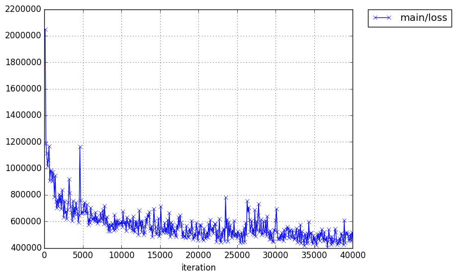
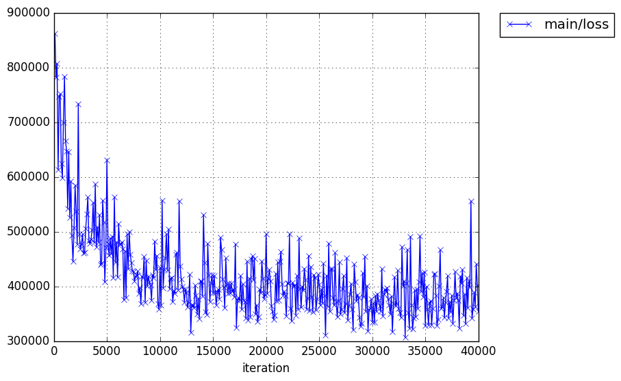
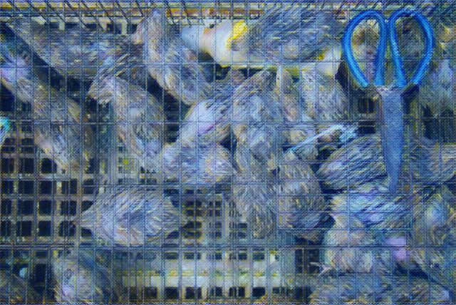
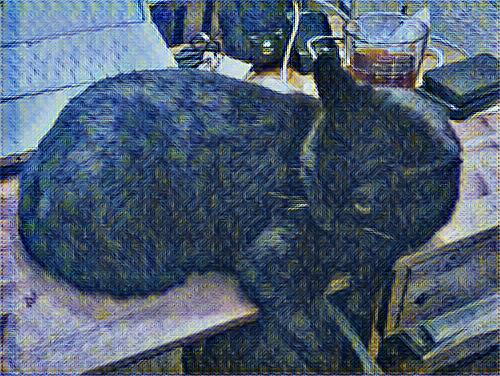
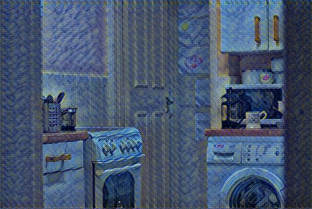

# chainer neural-style & fast-neural-style
Chainer implementation of [A Neural Algorithm of Artistic Style](http://arxiv.org/abs/1508.06576)
and [Perceptual Losses for Real-Time Style Transfer and Super-Resolution](http://cs.stanford.edu/people/jcjohns/eccv16/). 

## neural style
### Download VGG-19
Download the original [VGG-19 model](https://gist.github.com/ksimonyan/3785162f95cd2d5fee77#file-readme-md) and then convert it to Chainer model:
```bash
python caffe_model_2_pickle.py
```
**Or** Download the converted VGG-19 Chainer model [here](https://drive.google.com/open?id=0Bybnpq8dvwudM0U3enFsYV9waWM).
### Now you're an artist!!
```
 python neural_style.py --content_image [Content Image] --style_images [Style Image;Style Image;...] 
```
*Note*: `python neural_style -h` for more details.
### Your Gallery
* Content Image

  
* Style Image

  
* Result
  * `--original_color False --style_color False`
  
    _Starry_Night.png)
  * `--original_color True`
  
    _Starry_Night.png)
  * `--style_color True`
  
    _Starry_Night.png)
* Content Image

  
* Style Images

  

  
* Result Image

  _Starry_Night_the_scream.png)

## fast neural style
### Download Dataset
Download COCO [training set](http://msvocds.blob.core.windows.net/coco2014/train2014.zip) and [validation set](http://msvocds.blob.core.windows.net/coco2014/val2014.zip). `unzip` training set and validation set under the same root folder.
### Download VGG-19
See above.
### Training using Batch Normalization
```bash
python fast_neural_style.py --data_root [COCO ROOT FOLDER] --instance_normalization False
```
* Training Curve

### Training using Instance Normalization
```bash
python fast_neural_style.py --data_root [COCO ROOT FOLDER] --instance_normalization True
```
* Training Curve

### Gallery
* Batch Normalization

  

  

  
* Instance Normalization
  
  
  
  
